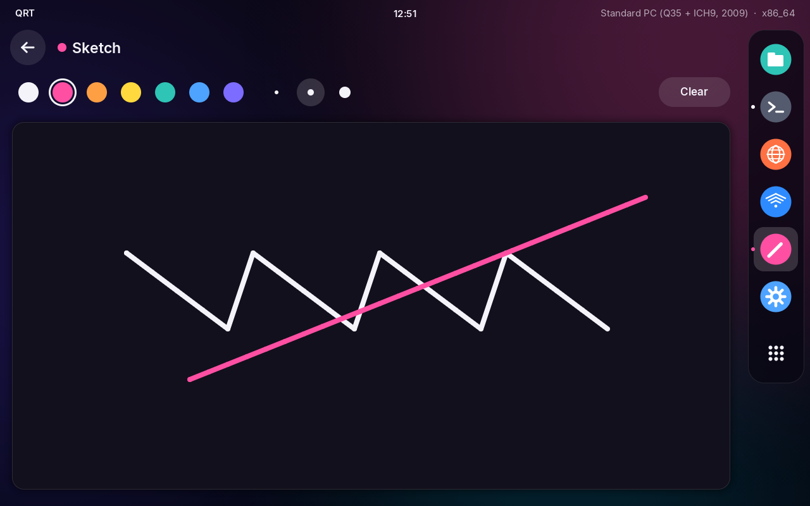
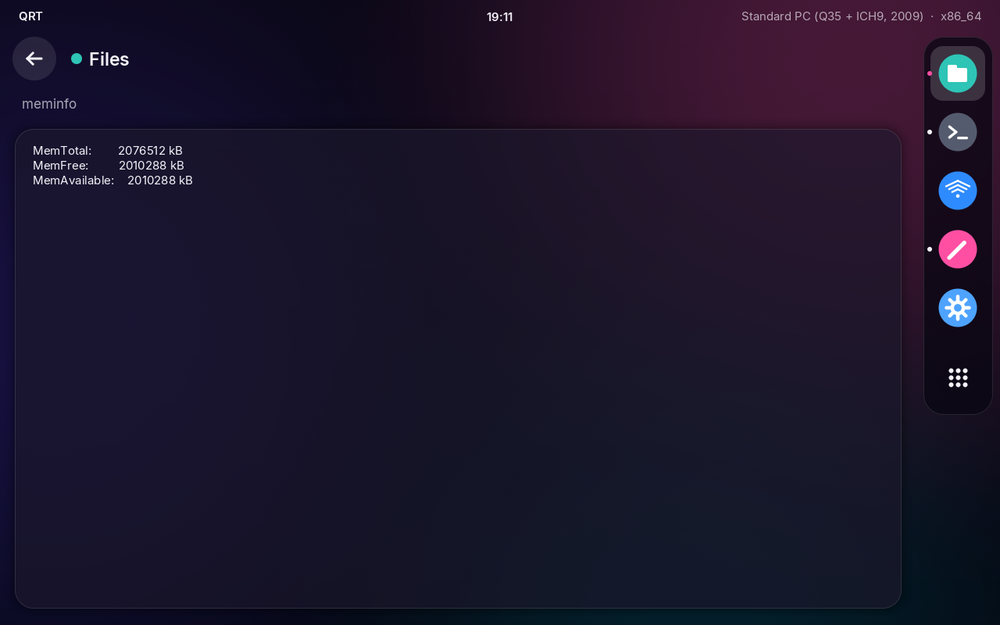
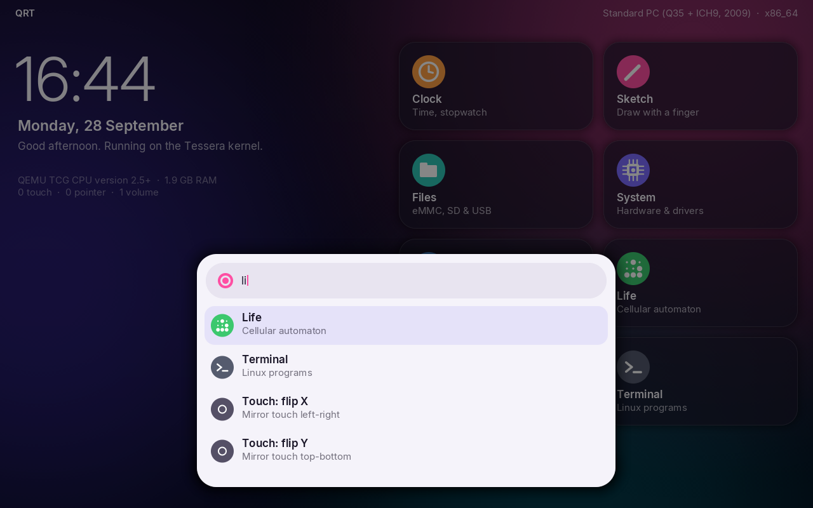

# QRT

A small custom operating system for the **Dell Venue 8 Pro**, with a touch-first
UI inspired by Fuchsia's Armadillo/Ermine shells. It is not Linux, it does not
use a Linux kernel and it has no Linux drivers.

<p>


</p>

| | |
|---|---|
|  |  |
|  |  |

## The kernel: Tessera, a firmware-hosted exokernel

Tessera never calls `ExitBootServices()`. The tablet's own UEFI firmware stays
resident underneath it and serves as the driver layer. That firmware is the
same code that runs the Venue's touch-driven BIOS setup screen:

| Subsystem | Provided by (UEFI protocol) | Tessera's job on top |
|---|---|---|
| Display | Graphics Output Protocol (native panel mode) | software compositor, AA rasteriser, 0/90/180/270° rotation |
| Touchscreen | Absolute Pointer | tap/drag gestures, axis swap/flip calibration |
| Mouse / trackpad | Simple Pointer | cursor with sub-pixel accumulation |
| Keys & hardware buttons | Simple Text Input | Ask bar, keyboard navigation |
| eMMC / microSD / USB storage | Block I/O + Simple File System (FAT) | volume discovery, Files app |
| Clock | Runtime `GetTime` + TSC calibrated against `Stall` | monotonic clock, wall time |
| Settings | NVRAM variables | persisted rotation, accent colour, touch mapping |
| Power | `ResetSystem`, `OsIndications` | restart, shut down, reboot into firmware setup |
| Identity | SMBIOS, ACPI RSDP, CPUID, memory map | System app, Venue detection |

At boot the kernel runs the equivalent of `connect -r`: it asks the firmware to
bind every driver to every controller, so hardware that "fast boot" skipped
(touch, SD, USB) comes up. It also turns off the 5-minute boot-loader watchdog.
After that it hands control to the shell's event loop.

Why this approach and not an existing kernel? Every other non-Linux option was
checked against this tablet, and none could drive it:

- Haiku, FreeBSD, Redox and Zircon/Fuchsia all lack working drivers for the
  Venue's Bay Trail/Cherry Trail I2C touch, SDIO Wi-Fi and 32-bit UEFI mix.
- Fuchsia itself can't boot 32-bit UEFI at all.

Borrowing the firmware's drivers is the only non-Linux way to get working
touch, display, storage and buttons on this device today.

## What works, what doesn't

**Works (tested in QEMU/OVMF, both 32-bit and 64-bit UEFI):** boot, the shell,
all six apps, rotation, NVRAM settings, FAT volumes, keyboard input and the
Ask launcher. Touch is tested through a serial injection channel, because
stock OVMF has no pointer drivers.

**Should work on the Venue (it uses the same firmware services), but is untested on real hardware:**
- Touch, through the firmware's absolute-pointer driver. If the axes come out
  wrong, type `touch` in the Ask bar on a USB keyboard to swap or flip them.
- The volume buttons, if the firmware reports them as keys.
- USB keyboards and mice on the OTG port.
- The eMMC's EFI partition and microSD cards, if they are FAT-formatted.

**Does not work, by design of this approach:**
- Wi-Fi and Bluetooth: the firmware has no drivers for them.
- Audio, camera, sensors and the battery gauge.
- Sleep and backlight control.

A future step would be native Tessera drivers for the Intel DesignWare I2C
controller and HID-over-I2C. That would take over touch from the firmware and
allow `ExitBootServices()`.

## Hardware report (step one toward native drivers)

On every boot QRT writes the machine's hardware description to the stick,
under `\qrt\hwdump\`:

- every ACPI table (`DSDT.aml`, `SSDT*.aml`, `APIC.aml`, and so on)
- the raw SMBIOS table
- `report.txt`, which lists the PCI devices, the ACPI device IDs (`_HID`)
  found in the AML, and the boot log

Native drivers for the tablet's I2C touch, SDIO, audio and battery have to be
written against this real data. Decompile the tables with
`iasl -d DSDT.aml SSDT*.aml`.

## Which Venue 8 Pro?

- The **5830** (2013–14) has a Bay Trail Z3740D, 1–2 GB of RAM and an
  800×1280 panel. Its firmware is **32-bit UEFI**.
- The **4 GB / 64 GB** configuration is normally the **5855** (2016). It has a
  Cherry Trail x5-Z8500 and a 1200×1920 panel, and its firmware is most
  likely 64-bit UEFI.

The image carries both `\EFI\BOOT\BOOTIA32.EFI` and `\EFI\BOOT\BOOTX64.EFI`,
so the firmware picks the right one by itself. The UI scales to the panel's
density: 1.18× at 800 px and about 1.76× at 1200 px.

## Put it on the tablet

Your Windows install on the eMMC is not touched: QRT runs entirely from the stick.

1. Get the image. Either use `dist/qrt-0.1.0.img.gz` (prebuilt) or build it
   with `make`.
2. Write it to a USB stick. Use Rufus, balenaEtcher, or on Linux:
   `gunzip -c dist/qrt-0.1.0.img.gz | sudo dd of=/dev/sdX bs=4M conv=fsync`.
3. Plug the stick into the tablet's micro-USB port with an OTG adapter.
4. Open the firmware settings. From Windows: *Settings → Update & Security →
   Recovery → Advanced startup → Troubleshoot → UEFI Firmware Settings*.
5. Disable **Secure Boot**. The image is not signed.
6. Pick the USB stick from the boot menu.

The first boot shows the Tessera splash with the live kernel log, then the home
screen. **Settings → Firmware** reboots straight back into the BIOS setup.

## Build it yourself

You need `clang`, `lld`, `mtools`, `dosfstools` and `gdisk`. For `make run` and
`make test` you also need `qemu-system-x86` and `ovmf` + `ovmf-ia32`. Pillow is
needed only to regenerate the fonts.

```sh
make            # build/BOOTIA32.EFI, build/BOOTX64.EFI, build/qrt.img
make run        # boot in QEMU on 32-bit UEFI (like a 5830)
make run64      # boot in QEMU on 64-bit UEFI
make test       # headless boot on both, scripted walkthrough, screenshots in build/shots/
```

In QEMU, OVMF has no mouse or tablet driver, so use the keyboard. Start typing
to open the Ask bar, use the arrow keys and Enter on the home grid, and press
Esc to go back.

## Layout

```
src/efi.h              UEFI ABI subset (written from the spec, no EDK2/gnu-efi)
src/kernel/            Tessera: boot, clock, HAL (display/input/storage/power/NVRAM), sysinfo, runtime
src/ui/                gfx (anti-aliased shapes, text), font atlas, shell (home, Ask, chrome, rotation)
src/apps/              Clock, Sketch, Files, System, Settings, Life
tools/                 mkfont.py (Inter -> AA glyph atlases), mkimage.sh, run-qemu.sh, qemu-test.py
assets/                Inter typeface (SIL OFL 1.1, see Inter-LICENSE.txt)
```

Apps implement a five-function ABI (`open`, `draw`, `event`, `tick`, `icon`) in
`src/ui/shell.h`. Adding one takes about 100 lines.
