# QRT

A small custom operating system for the **Dell Venue 8 Pro**, with a touch-first
desktop styled after GNOME (libadwaita, dark). Its kernel, **Tessera**, is
written from scratch. It is not Linux, but it can run Linux programs.

<p>
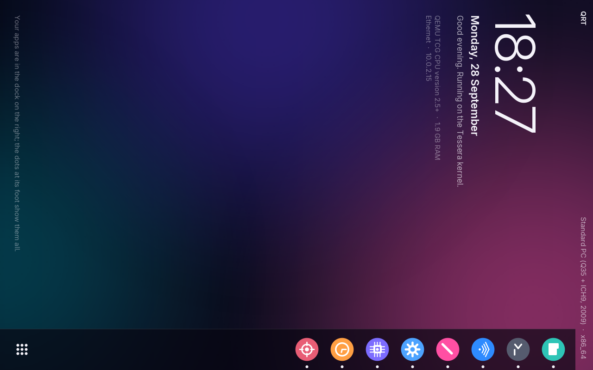
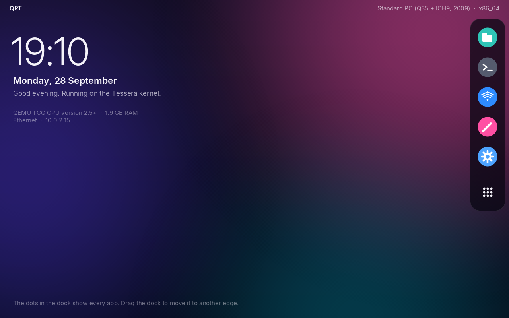
</p>

| | |
|---|---|
| 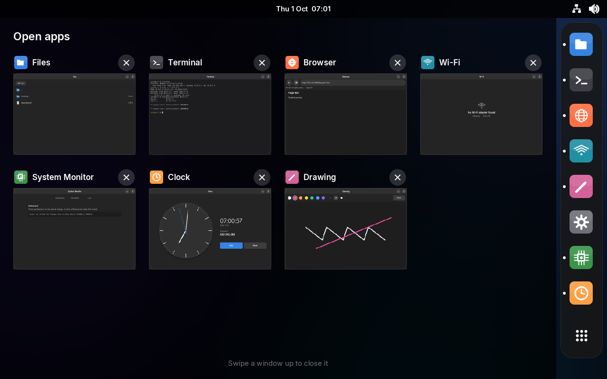 | 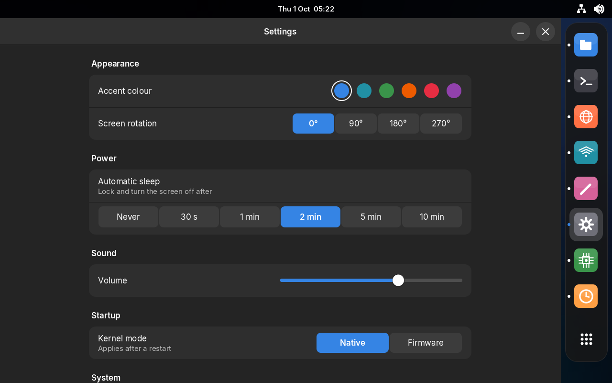 |
| 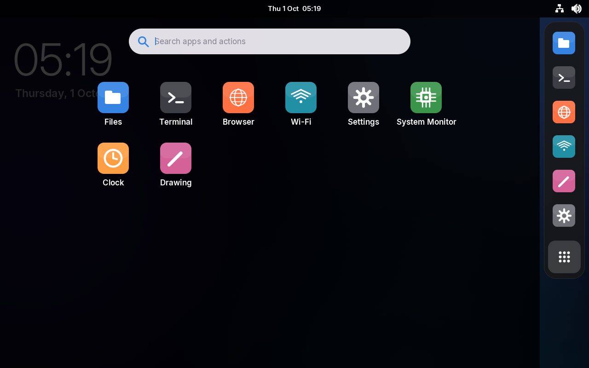 | 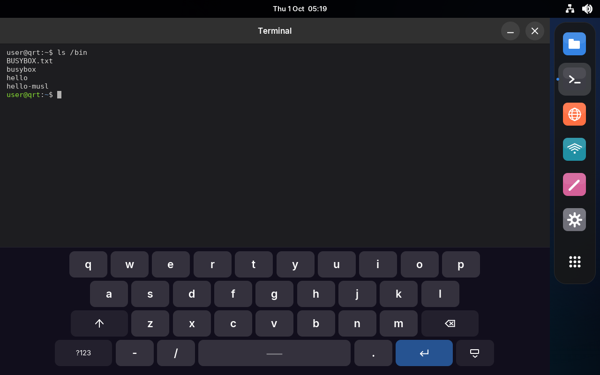 |
| 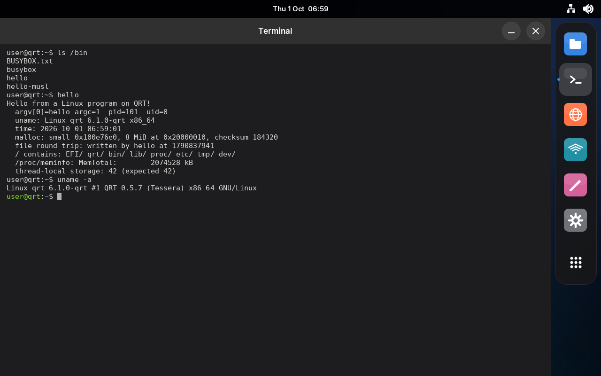 | 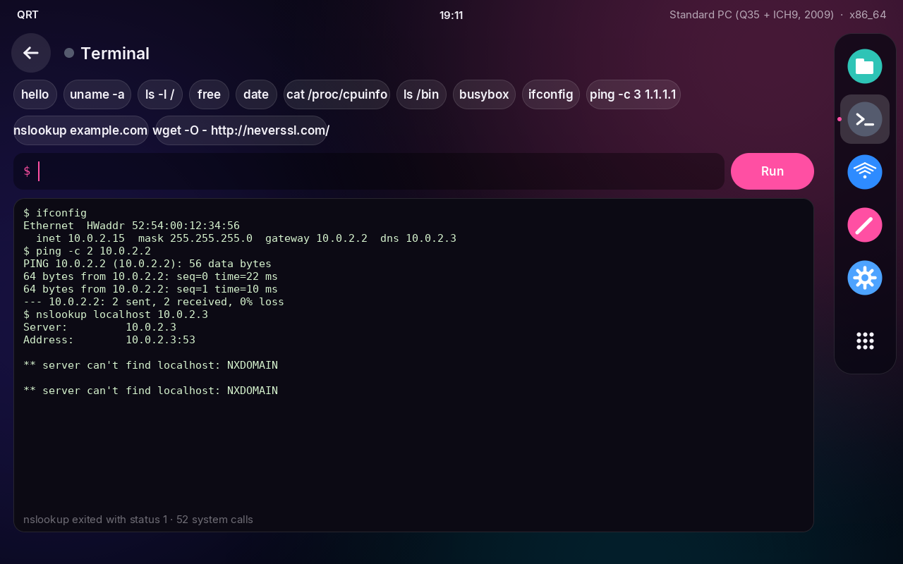 |
| 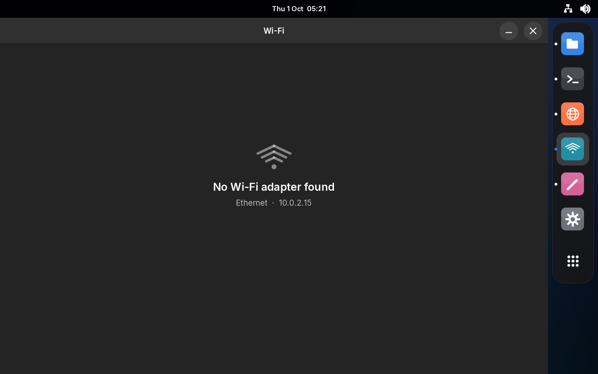 | 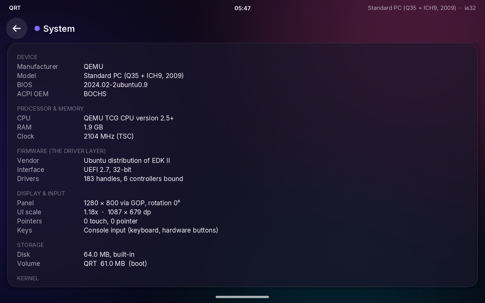 |
| 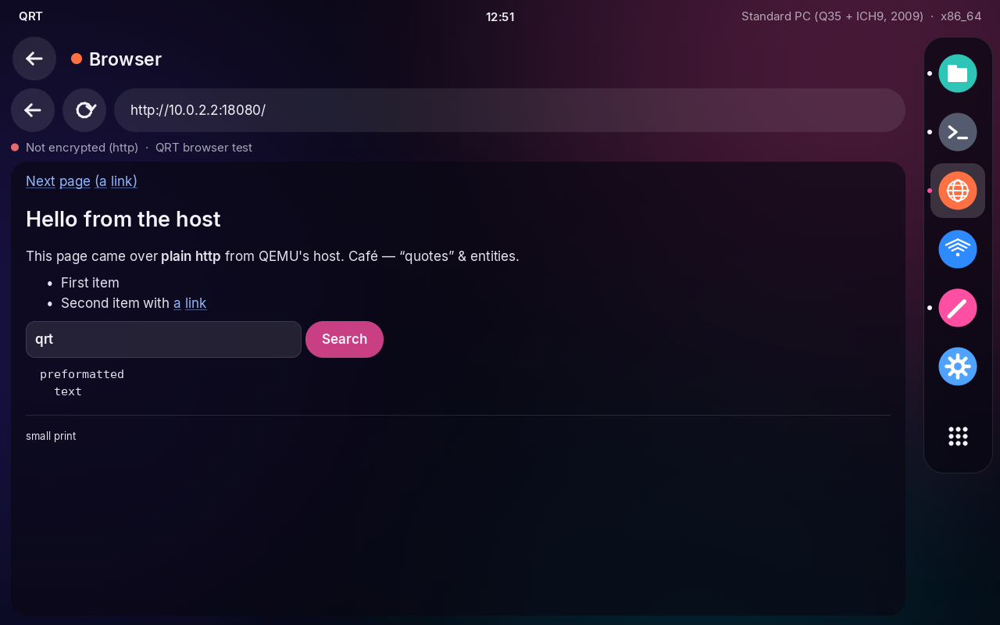 | 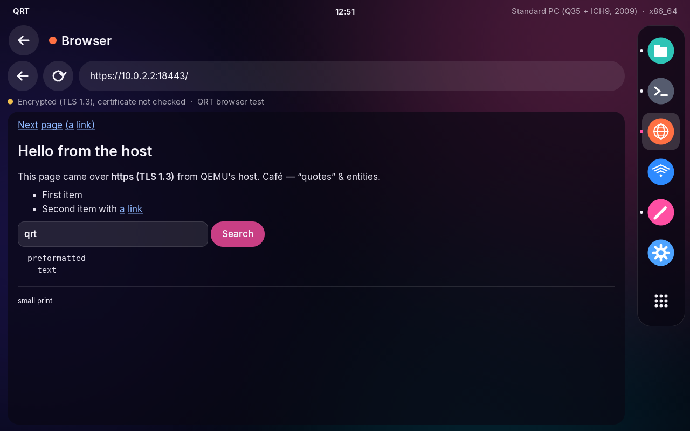 |
| 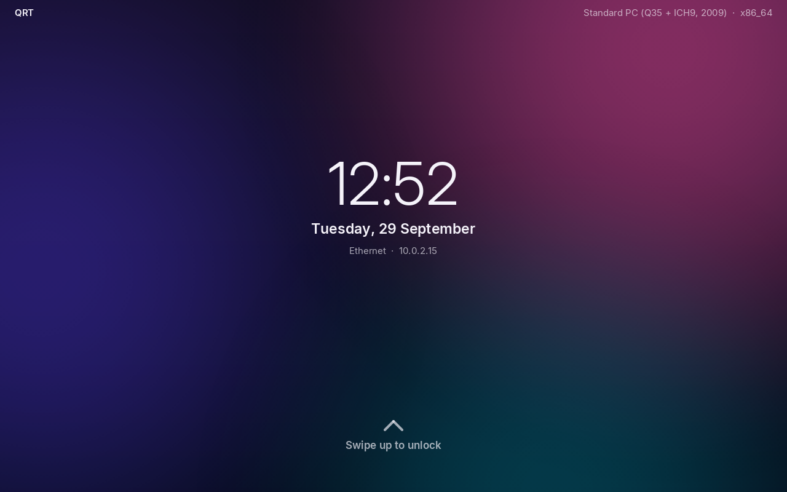 | 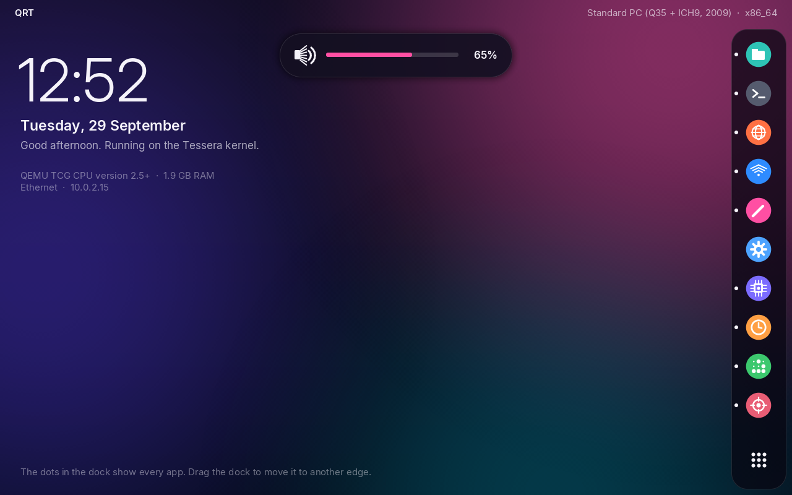 |
| 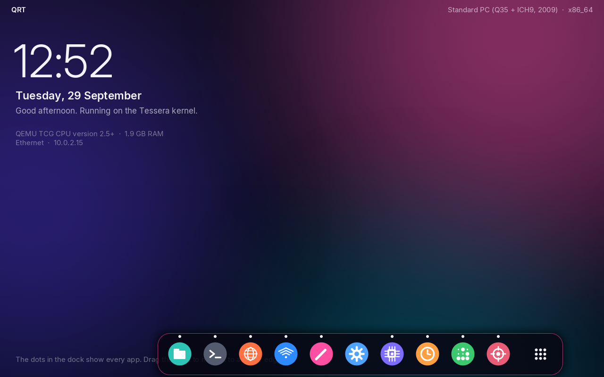 | 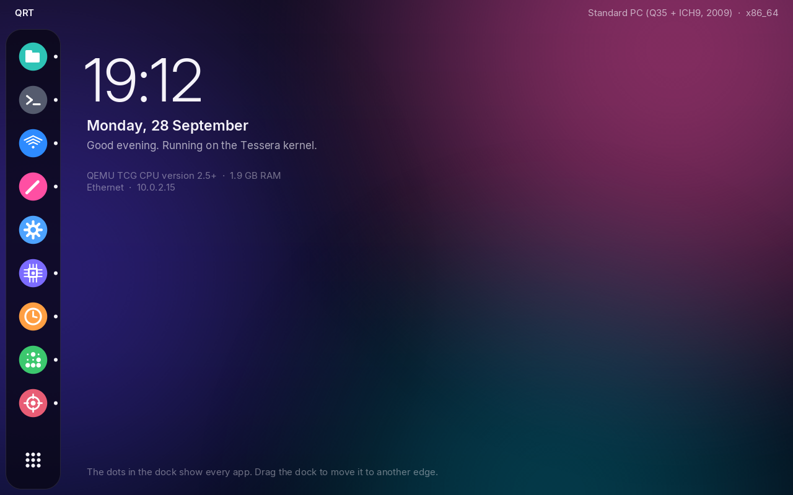 |

## The shell

- **Look.** Dark, flat and in GNOME's colours.
  - A black top bar shows the date and time in the middle and network and
    volume icons at the right.
  - Every app is a window: a header bar with its title, a minimise button
    and a close button.
  - Settings, Wi-Fi, Files and System Monitor follow GNOME's layouts:
    grouped rows, switches and sliders.
- **Open apps.** Swipe up on the home screen. Every open app appears as a
  picture of its window, taken when you last left it.
  - Tap a window to switch to it.
  - Tap its × or swipe it up to close it.
  - Tap the empty space to go back.
  - The launcher's search finds this view too ("Open apps").
- **Closing apps.** The × in a window's header bar closes the app; the –
  minimises it to the home screen. A closed app leaves the dock unless it
  is pinned. The Terminal ends its program and starts a fresh session.
- **Dock.** A rounded panel floating along one edge holds pinned apps
  (Files, Terminal, Browser, Wi-Fi, Drawing, Settings) and any others you
  open. A dot marks running apps. Tapping the app in front minimises it.
  - Drag the dock to move it. It stays under your finger at the spot you
    picked it up, and takes the shape it will have on the nearest edge.
    On release it glides to that edge (left, right, top or bottom).
  - While it moves, only the dock's own area is redrawn, not the whole
    screen, which keeps dragging smooth on the tablet.
  - The edge is saved in NVRAM, so the dock stays there after a reboot.
- **Launcher.** The 3×3 dots at the end of the dock open a grid of every
  app. Its search field also finds actions, such as open apps, rotate,
  restart and the touch fixes. Typing anywhere on the home screen opens
  it.
- **On-screen keyboard.** Tapping a text field brings it up: the launcher
  search, the Terminal command line, a Wi-Fi password, or the browser's
  address bar and form fields. It has letters,
  digits and two symbol pages, shift and caps lock, a repeating backspace,
  and cursor keys.
- **Hardware buttons** (Venue 8 Pro 5855, both kernel modes):
  - **power**: locks the screen. Pressed on the lock screen, the tablet
    sleeps; pressed while asleep, it wakes. Held for a second, it opens the
    power menu (sleep, restart, shut down, firmware setup).
  - **volume up / down**: change the volume and show an on-screen volume
    bar. Holding a key repeats. There is no sound driver yet, so this
    is a mock control: the level is kept and saved, but nothing plays.
  - **Windows button**: opens and closes the launcher (the dock's list of
    all apps).

  QRT reads them from three sources:
  - the input bit of the Cherry Trail GPIO pads the DSDT names. At start-up
    QRT switches each pad to GPIO-input mode, as Linux's pinctrl-cherryview
    does.
  - the GPIO controller's interrupt-status register, which latches every
    edge on those pads even when the input bit does not move.
  - for power, the ACPI fixed power button: this tablet's FADT declares
    one, so a press sets `PWRBTN_STS` in `PM1_STS` (I/O port 0x400). QRT
    switches the firmware into ACPI mode first (`SMI_CMD`), as an OS does,
    so that the firmware's SMI handler stops taking the press. This source
    reports presses only, so a power press it catches is always short.

  **Button test** (type "button" in the launcher) shows each source live.
  In QEMU, keys on the serial console stand in for the buttons: F9 and F10
  for volume, F11 for power, F12 for power held, F8 for Windows.
- **Animations.** Changes of view animate:
  - Apps rise in when they open and sink away when minimised or closed.
  - The launcher and the open-apps view slide up, and the lock screen
    fades in.
  - Swiping up for the open apps, and swiping up to unlock, follow the
    finger. On release the view finishes the move, or snaps back if it
    went less than a third of the way.
  - The dock and the top bar stay still while the content moves.
  - An animation frame only blends or shifts two finished pictures (the
    old screen and the new state, drawn once), on every core, so it costs
    about one copy of the screen.
- **Lock screen and sleep.** The lock screen shows the time and the date.
  Swipe up to unlock (or press Enter on a keyboard).
  - After a period without a touch or a button press, QRT locks and
    sleeps. Set the period in **Settings → Sleep after**: never, 30 s,
    1, 2 (the default), 5 or 10 minutes. On the lock screen it sleeps
    after 20 seconds.
  - Asleep, the backlight is off (on machines without backlight control,
    the screen is black) and the frame loop slows down. Wi-Fi stays
    connected.
  - Only the power or Windows button wakes the tablet; touch does not.
    On machines without these buttons, a touch wakes it.
  - This is not ACPI suspend: QRT cannot enter S0ix/S3 yet, so the
    tablet still draws more power asleep than it would under Windows.
- **Brightness.** **Settings → Power → Screen brightness** sets the
  backlight. It drives the SoC's PWM controller, which the DSDT links to
  the panel.
- **No boot text.** The boot log goes to the serial port and to **System
  Monitor → Log**, not to the screen.

## The kernel: Tessera

QRT is one UEFI application, and it boots in two stages.

**1. Under the firmware.** Tessera starts as a UEFI program. It does the
following:
- reads the machine's identity (SMBIOS, ACPI, CPUID, memory map)
- asks the firmware to connect every driver
- dumps the ACPI tables
- copies the boot stick into RAM
- probes the touchscreen with its own I2C driver

**2. Native (64-bit firmware).** Tessera then calls `ExitBootServices()` and
takes over the machine. From then on, everything is QRT's own code:

| Subsystem | Native Tessera |
|---|---|
| Memory | physical page allocator, kernel heap, 4-level page tables (identity map with 2 MB pages, write-combining framebuffer via PAT) |
| CPU | per-core GDT/TSS/IDT, exception handling with a crash screen |
| Interrupts | local APIC (xAPIC/x2APIC); I/O APIC routing from the MADT; MSI for PCI |
| Time | TSC calibrated at boot, 1 kHz local-APIC timer |
| Scheduling | preemptive threads, 10 ms round-robin; idle cores halt |
| Multicore | other cores started by QRT itself (INIT/SIPI through a real-mode trampoline) and used for rendering |
| Files | in-memory file system: the boot stick plus `/proc`, `/etc`, `/tmp`, `/dev` |
| Processes | ring-3 address spaces, ELF loader, demand paging, `SYSCALL` entry |
| Linux ABI | the system calls static glibc, musl and busybox programs need, including sockets and poll/select |
| Network | Ethernet/802.11 → ARP, IPv4, ICMP, UDP, TCP; DHCP client, DNS resolver (`src/net/`) |
| Drivers | a driver model over PCI, ACPI and platform devices; see below |

The firmware is kept only for its *runtime* services: the RTC, NVRAM
variables (where settings are stored) and reset/power-off.

The UI and the apps behave the same in both stages. Underneath, a HAL
(`src/kernel/hal.c`) hands them either firmware services or native drivers.

### Safety

Native mode has fallbacks, because without the firmware QRT must bring
touch back up on its own:

- QRT goes native only if it can drive an input device itself: the native
  touchscreen, or a serial console.
- If the touchscreen does not answer after the handover, QRT records the
  failure and reboots once into firmware mode.
- **Holding any key or hardware button** at boot starts in firmware mode.
- **Settings → Kernel mode** switches between native and firmware for the
  next boot.

On 32-bit UEFI (Venue 8 Pro 5830) QRT always runs in firmware mode.

## Linux programs

Open **Terminal**. It runs x86-64 Linux ELF programs, unmodified, through
Tessera's Linux system-call layer (`src/arch/x64/linux.c`, `proc.c`), the way
WSL1 or FreeBSD's Linuxulator do: this is the Linux ABI, not the Linux
kernel.

Since 0.6.0 that includes **dynamically linked programs**. A program that
names a loader (`PT_INTERP`) gets it: the kernel maps
`/lib64/ld-linux-x86-64.so.2` next to it and starts there, and glibc's loader
maps `libc.so.6` and the rest itself with file-backed `mmap` (`MAP_FIXED`
included), as on any Linux system. Threads work too: `clone` for threads
(the new thread starts from a copy of its parent's registers and gets its own
TLS), and `futex` with `WAIT`/`WAKE`, bitsets, timeouts, `REQUEUE` and
`WAKE_OP`, which is what glibc's mutexes, condition variables and
`pthread_join` sleep on. The image ships glibc 2.39's loader, `libc`, `libm`,
`libstdc++` and `libgcc_s` in `/lib/x86_64-linux-gnu`, and three test
programs:
- `dynhello` loads `libm` at run time with `dlopen`.
- `threads` runs four threads through a mutex, a condition variable and
  `pthread_join`.
- `cxx` uses libstdc++: containers, exceptions, `std::thread`, iostreams.

The QEMU test runs all three and checks that they exit with 0.

The image also includes a static **busybox**, so `ls -l /`, `cat
/proc/cpuinfo`, `free`, `date`, `sha256sum`, `wc`, `uname -a`, and anything
else busybox provides work. `hello` (static glibc) and `hello-musl` check
stdio, `malloc`, files, directory listing, `/proc` and TLS.

To add your own program, build it on an x86-64 Linux machine (dynamically
against glibc, or `-static`) and copy it into `\bin` on the stick, with any
extra libraries in `\lib\x86_64-linux-gnu`.

Programs can use the network. Linux `AF_INET` sockets (TCP, UDP and ICMP),
`poll` and `select` sit on QRT's own TCP/IP stack. glibc resolves names
through the generated `/etc/resolv.conf`, so busybox `wget` and `nslookup`
work.

The Terminal also has a few built-ins:
- `ping [-c N] HOST`
- `ifconfig`
- `wifi`
- `clear`
- `help`

Since 0.6.3 there are **processes**: `fork`, `vfork`, `clone` without
`CLONE_THREAD`, `execve` (with `#!` scripts; names in `/bin` that are not
files run as busybox applets), `wait4`, `pipe`/`pipe2`, `dup`/`dup2`/`dup3`,
`FD_CLOEXEC`, `kill` and `getppid`. A command line with shell syntax (`|`,
`>`, `;`, `&&`, `$`, `*` and so on) runs through busybox `sh -c`, so
`ls /bin | wc -l` or `cat /proc/cpuinfo > /tmp/cpu; wc -l /tmp/cpu` work.
`procs` tests fork, pipes, exec, `posix_spawn`, `popen` and `kill`.

Since 0.7.0 (Firefox milestones 2 to 4, see [docs/roadmap.md](docs/roadmap.md)):

- **Signals** (`src/arch/x64/signal.c`): `rt_sigaction` with and without
  `SA_SIGINFO`, per-thread masks, pending sets, `sigaltstack`, `kill`,
  `tgkill` (`raise`, `pthread_kill`), `sigsuspend`/`pause`, `sigtimedwait`,
  `alarm`/`setitimer`, `SIGCHLD`, `SIGPIPE`, and the default actions. A
  handler runs on Linux's own `rt_sigframe` layout (so glibc's and musl's
  `siglongjmp`, `ucontext` and restorers work). It is called when the thread
  next returns to user mode: after a system call, after an interrupt (so a
  busy loop gets its `SIGALRM`), or on a fault. Faults become signals: a store
  to a read-only page or a jump into data gives `SIGSEGV` with the address,
  division by zero `SIGFPE`. Blocking calls return `EINTR`, or start again
  under `SA_RESTART`.
- **Memory**: every process now has its first GiB plus 448 GiB more (64 to
  512 GiB) for `mmap`, so reservations of several GiB, as Firefox makes for
  its JIT and WebAssembly, fit. Pages have real protections:
  - read-only and no-execute (NX) pages;
  - `PROT_NONE` reservations committed piece by piece with `mprotect`;
  - a JIT's write-then-execute.

  Shared memory works through `memfd_create`, `/dev/shm` (`shm_open`) and
  `MAP_SHARED`, also anonymous and across `fork`. `mremap`,
  `MADV_DONTNEED`, `unlink`/`rename` and 256 descriptors per process are
  supported too.
- **Event loops**: `epoll`, `eventfd`, `timerfd`, `signalfd`, and Unix
  sockets (`src/arch/x64/unix.c`):
  - stream, datagram and seqpacket types; `socketpair`;
  - path and abstract names; `listen`/`accept`;
  - descriptors passed with `SCM_RIGHTS`; `SO_PEERCRED`;
  - hang-up through `poll`/`epoll`.

  This is what Wayland and Firefox's own IPC run on.

`signals`, `memory` and `events` in `/bin` test all of this, and the QEMU test
runs them. They pass on Linux too, so a failure means QRT differs from it.
Writing to `/dev/kmsg` puts a line in QRT's boot log (System Monitor → Log).

Not supported yet:
- IPv6
- keyboard input to programs, and any graphical program (a Wayland compositor
  is milestone 6)
- writes that survive a reboot (milestone 5)

## Wi-Fi and networking

The 5855's Wi-Fi is an **Intel Wireless 8260** on PCIe. QRT's driver
(`src/drivers/iwm/`) is a port of OpenBSD's `iwm(4)`. Unlike the original,
it is polled, so it runs the same in native and firmware mode. It covers:
- firmware loading, including the 8000 family's CPU1/CPU2 sections and
  firmware paging
- NVM and calibration
- UMAC scanning
- MAC/PHY/binding/station contexts
- the TX/RX rings
- hardware CCMP

On top of it, `src/net/wlan.c` does what net80211 does for iwm:
- scan results
- open-system authentication and association
- the WPA2-Personal 4-way and group-key handshakes (PBKDF2, the 802.11 PRF,
  AES key wrap)
- software CCMP for group-key broadcasts

`src/net/` then carries ARP, IPv4, ICMP, UDP, a DHCP client, a DNS resolver
and TCP.

To connect:
1. Open **Wi-Fi** and switch it on. Loading the firmware takes a second or
   two.
2. Pick a network.
3. Type the password on the on-screen keyboard.

The network and its derived key (not the password) are saved in NVRAM.
If Wi-Fi was on, QRT turns it on at the next boot and reconnects.

Supported: open networks and WPA2-Personal with CCMP.
Not supported:
- WEP, WPA1/TKIP
- WPA3/SAE, and networks that require management frame protection
- Enterprise (802.1X)
- hidden networks
- 802.11n/ac rates (QRT associates as an 802.11a/g station, up to 54 Mbit/s)

**Status: works on the tablet.** Scanning, WPA2 connection and DHCP were
confirmed on a Venue 8 Pro 5855 with 0.5.5.2. In 0.5.5, connecting froze
the tablet: the association response made the client send commands, and
while each command waited for its answer, the driver re-read the same
receive buffer and delivered the response again, recursing until the stack
ran out. The driver now queues received frames and hands them to the client
only from its poll loop.

QEMU has no 8260, so these parts are checked separately:
- The firmware file parses in QEMU.
- The WPA2 client logic passes a host test with a simulated access point
  (`tests/test_wlan.c`).
- The IP/TCP stack runs in QEMU on an e1000e driver: DHCP, DNS, `ping` and
  `wget` all work.

If a network does not connect, its log (**Wi-Fi → Log**) shows every step.
To save it:
1. Switch to **Settings → Kernel mode → Firmware** and reboot. In that mode
   the stick is writable.
2. Tap **Wi-Fi → Save log**. It writes `\qrt\hwdump\wifi.txt` to the stick.
   In firmware mode QRT also saves this file at every connection step, so
   the file survives even if the tablet hangs.

The firmware file (`\lib\firmware\iwlwifi-8000C-36.ucode`) comes unmodified
from linux-firmware, under Intel's redistribution licence; see
[firmware/](firmware/).

## Browser

**Browser** opens web pages over http:// and https://, as text and links.
There are no images, CSS or scripts. Its purpose is reading simple pages
and testing the network.

- **Address bar.** Tap it and type an address. Anything that is not an
  address is searched on [FrogFind](http://frogfind.com/), a search engine
  for vintage browsers whose result links pass through a proxy that strips
  pages down to plain HTML.
- **Pages.** It shows headings, paragraphs, lists, links, `<pre>`, tables
  (as lines), `` text, Latin-1 and UTF-8 text, and HTML entities.
- **Forms.** GET and POST forms with text fields and submit buttons work,
  which covers search boxes such as DuckDuckGo Lite's.
- **Navigation.** Redirects and chunked replies are handled. Back keeps up
  to 32 pages, with their scroll positions.
- **The network code.** `src/net/http.c` is an HTTP/1.1 client. For
  https:// it runs over `src/net/tls.c`, QRT's own TLS 1.3 client
  (X25519 key exchange, AES-128-GCM). SHA-256, HKDF, X25519 and GCM are in
  `src/net/crypto_tls.c`, checked against the RFC and NIST test vectors.
  `make check-tls` tests the handshake against OpenSSL.

**Security: certificates are not checked yet.** An https:// page is
encrypted, so someone listening on the network cannot read it. But QRT
does not verify the server's certificate, so it cannot prove it is talking
to the real site. The status line says so on every https page. Do not
enter passwords.

Not supported yet:
- gzip-compressed replies (QRT asks for uncompressed pages, and most
  servers comply)
- servers that speak only TLS 1.2 or offer no X25519 key exchange
- cookies

## Drivers

`src/kernel/dev.h` is the driver model. Buses enumerate devices from PCI
(ECAM), ACPI (the `_HID`s in the DSDT/SSDTs) and fixed platform devices.
Drivers declare id tables and a `probe()`. **System Monitor → Hardware** lists every
device, first those with a QRT driver and then those still waiting for one.
On the tablet, that second part is the to-do list.

Built in:
- **i915**: the Cherry Trail GPU's 3D engine puts the screen on the panel
  (see Rendering)
- **framebuffer**
- **16550 UART**: interrupt-driven through the I/O APIC
- **DesignWare I2C**
- **HID over I2C**: the Venue's Wacom touchscreen
- **gpio-buttons**: the Venue's power, volume and Windows buttons
- **backlight**: the panel backlight through LPSS PWM #1
- **iwm**: Intel Wireless 8260 (Wi-Fi)
- **xhci**: USB 3 host controller; devices on root ports, boot-protocol
  keyboards (written from the xHCI specification, with OpenBSD's xhci(4)
  as the reference)
- **audio**: identifies the Realtek codec (RT5670/RT5672 on the 5855); the Intel SST DSP is listed
- **bt**: Bluetooth over USB (`src/drivers/bt/`): Intel firmware loading after Linux's btusb.c/btintel.c, HCI, classic and LE scanning
- **e1000**: Intel 8254x/82574 Ethernet. This is QEMU's NIC; it is here so
  the network stack can be tested.
- **chipset**: devices the kernel handles itself

[docs/roadmap.md](docs/roadmap.md) lists what comes next (Firefox, GPU drawing, audio, Bluetooth). [docs/drivers.md](docs/drivers.md) covers the primitives a driver gets
(MMIO, DMA memory, IRQ/MSI, threads). It also lays out the plan for using
Linux drivers: port them by hand now, then a LinuxKPI-style shim like
FreeBSD's.

## Hardware status on the Venue 8 Pro 5855

| | |
|---|---|
| Display | works (framebuffer, 1200×1920, rotation) |
| GPU | Intel Gen8 3D engine copies and turns each frame: **works** (0.5.8, coherent mode); it tests itself at boot and falls back to the CPU |
| Touch | works: QRT's own Wacom driver; tested on the tablet in firmware mode. Native mode needs the same driver after the handover, which is **new in 0.5 and untested on hardware**. |
| Storage | the boot stick is read into RAM at boot; writes go to RAM only |
| Buttons | power, volume and Windows through GPIO (input bit and edge latch) and the ACPI fixed power button, both kernel modes. Pins confirmed on the tablet with the Button test's pad scanner: SW/5f Windows, SW/5d volume up, N/08 volume down (power: PMU_PWRBTN_B, left in its native function for the ACPI power button). Up to 0.5.9 the driver never started on the tablet: the ACPI device list did not bind it (the Button test said "not started"). 0.5.9.1 starts it from the input path: **works** (volume, Windows); 0.5.9.2 also raises the device table limit that dropped the button devices. |
| Wi-Fi | Intel 8260 driver, WPA2-Personal: **works** (scanning, connecting, DHCP) |
| Backlight | LPSS PWM #1, native mode: brightness and sleep (**new in 0.5.5.3, untested on hardware**). QRT only takes control if the firmware left that PWM running. |
| Sleep | backlight off and a slower frame loop; not ACPI suspend |
| Audio | no sound yet: 0.6.1 identifies the codec over I2C2 - an RT5670/RT5672 on the tablet (System Monitor → Hardware → Sound); the volume keys drive a mock volume control |
| USB | 0.6.1: QRT's own xHCI driver in native mode: devices on the root ports and behind USB 2 hubs (0.6.3) are listed under System Monitor → Hardware → USB; USB keyboards work, also behind a hub (tested in QEMU); USB mice since 0.6.5. USB-C docks show up by name (USB billboard class). |
| External display | 0.6.4: a monitor on a USB-C dock (DisplayPort Alt Mode, HDMI behind the dock's converter): **works** (detected and mirrored on the tablet). 0.6.5: desk mode - the shell moves to the monitor and the tablet becomes its touchpad and keyboard; see [External display](#external-display-064) |
| Mouse | 0.6.5: USB mice, also wireless receivers and keyboard-and-mouse combos (HID report descriptors; buttons, wheel, absolute pointers); a cursor on whichever screen the shell is on |
| Bluetooth | 0.6.2: the Intel 8260's Bluetooth (USB 8087:0a2b, root port 4): firmware download as Linux's btusb/btintel do it, then scanning for classic and LE devices in the **Bluetooth** app (works on the tablet: it finds devices); no pairing yet |
| Camera, sensors, battery | no drivers yet (they need ACPI/PMIC support first; see docs/drivers.md) |
| USB keyboard | both modes (native: QRT's xHCI driver, 0.6.1) |

## Hardware report

On every boot QRT writes the machine's hardware description to the stick,
under `\qrt\hwdump\`:
- every ACPI table
- the SMBIOS table
- `report.txt` (PCI devices, ACPI ids, boot log)

The dump is taken before the handover, while the stick is still writable.
Reports saved later (Touch Lab's `touch.txt` in native mode) go to the RAM
copy.

**Keep that folder private.** On Windows tablets, `MSDM.aml` contains the
Windows product key.

## Rendering

Everything is drawn on the CPU. Each change records a damage rectangle,
and only that area is redrawn and copied to the panel. Big redraws are cut
into strips (4 per core), and every core claims strips from a shared
counter. In native mode those cores were started by QRT. Under the firmware
they come from UEFI's MP Services.

In QEMU with 4 cores, a full 1280×800 redraw drops from 74 ms on one core to
24 ms. Type `bench` in the launcher's search field to measure; the result
appears in **System Monitor → Hardware**.

When the screen is rotated (the 5855's panel is portrait, so landscape use
is rotated), every frame must be turned before it reaches the panel. Up
to 0.5.6 that was a straight per-pixel loop: each write landed on a new
cache line, and the rotation took most of the frame time. In 0.5.7 the
frame is turned in 32×32 tiles, which keeps both reads and writes in the
cache. The tiles are spread over every core and written straight into
the framebuffer in native mode, instead of through a staging copy. With
the screen rotated in QEMU, a full frame went from 12.6 ms (10.7 ms of it
for the rotation) to 6.2 ms (4.0 ms).

### Scrolling (0.5.9)

Scrolling used to redraw the whole app on every finger movement. Now, once
a drag is past the tap distance, the shell moves the pixels that are
already on screen and asks the app to draw only the strip that came into
view (plus a narrow column at the right edge for scroll indicators). If
anything else changed in that area during the same frame, it redraws the
area as before. A flick keeps the content moving and slows it down, and a
touch stops it. The frame loop also no longer waits a fixed 10 ms after
every frame: it sleeps only what is left of the 10 ms period. The QEMU test
compares a scrolled screen with a full redraw of the same state, pixel for
pixel.

### GPU acceleration (0.5.8)

On the tablet in native mode, the GPU now does that last step. The driver
(`src/drivers/i915/`) brings up the render engine of the Cherry Trail's
Intel Gen8 graphics the way Linux's i915 does for a legacy render ring: it
keeps the render power well awake, enters its buffers and the canvas pages
in the global GTT, applies the Cherryview workarounds, starts the ring and
runs Linux's "golden" render state once. Each frame is then one 3D draw,
modelled on intel-vaapi-driver's Gen8 `put_surface`: the canvas is a texture,
the framebuffer is the render target, and every damaged rectangle is a
rectangle whose texture coordinates carry the rotation. The CPU only waits
for the GPU to finish.

What it does not do: the apps and the shell are still drawn by the CPU.
The GPU takes the copy and the rotation, which was the largest part of a
rotated frame.

Safety (it was released before it could be tried on a tablet; QEMU has no
Intel GPU). It has since been confirmed working on the 5855:
- It only starts in native mode, and only on 8086:22b0–22b3.
- At boot it turns a 64×64 test picture on the GPU and checks every pixel.
  If the GPU does not see the CPU's writes, it retries with explicit cache
  flushes. Any mismatch, and the CPU path is used.
- Every GPU job has a 100 ms limit. If one runs over, the GPU is reset and
  switched off for the rest of the session.
- If a start ever hangs the tablet, the next boot notices (a flag in NVRAM
  that is cleared after 20 good frames) and leaves the GPU off for that one
  boot. (Up to 0.5.9.1 the flag needed 300 frames and then switched the GPU
  off for good, so a short session could turn it off by mistake.)
- **Settings → Startup → Graphics acceleration** turns it on or off.

**System Monitor → Hardware → Graphics** shows its state and how long the
GPU takes per frame; `bench` in the launcher compares it with the CPU path
(turn acceleration off, run `bench` again). `make check` tests the parts
that can be tested without the GPU: the batch's command lengths, the
golden-state relocations, and that the texture coordinates sample exactly
the pixels the CPU rotation copies, for all four rotations.

### External display (0.6.4)

The 5855's USB-C port can carry DisplayPort (Alternate Mode). The switch to
DisplayPort happens in hardware - the DSDT has no Type-C or Power Delivery
controller for an OS to drive - so a dock's monitor appears to the display
engine as an ordinary DisplayPort sink on one of Cherry Trail's ports B, C or
D. Which one the USB-C port is wired to is not documented, so QRT looks at all
three. The internal panel (MIPI DSI on pipe A) is not touched.

`src/drivers/i915/display.c` follows Linux's i915 (v4.9) for Cherryview step
by step: it powers the DPIO PHY's common lanes through the PUNIT, talks to
the sink over the AUX channel (DPCD, and the monitor's EDID over I2C-over-AUX),
picks the monitor's preferred mode if the link can carry it (else the largest
listed one, else 1080p or 720p), sets up the PHY and the DP PLL with Linux's
fixed dividers, trains the link (clock recovery, then channel equalization,
with Linux's swing and de-emphasis table), and starts pipe B (ports B and C)
or pipe C (port D) with its own scanout buffer. The shell's picture is then
scaled into that buffer, centred, with black bars: by the GPU (bilinear)
when acceleration is on, by the CPU otherwise. A kernel thread checks the
ports once a second, so plugging and unplugging work while QRT runs.

- **Settings → Startup → External display** turns it on or off and says what
  it found: the monitor's name, the mode and the link, or the step that failed.
- If setting up a monitor ever hangs the tablet, the next boot notices (a
  flag in NVRAM) and leaves the external display off for that boot.
- `make check` runs the whole path against a simulated display engine and
  DP sink (`tests/test_display.c`): AUX messages, EDID parsing, the link
  choice, training, timings and M/N values, the plane, mirroring, unplugging.

It works on the tablet: the monitor is detected and mirrors the screen.

#### Desk mode (0.6.5)

When a monitor is connected, the shell moves to it: it is laid out for the
monitor's resolution and drawn only there (1:1, no scaling), with a mouse
cursor. The tablet's screen becomes the controller:

- a **touchpad**: slide to move the pointer, tap to click, tap and then slide
  to drag (lists scroll by dragging, as with a finger);
- a **scroll strip** beside it, like a mouse wheel;
- **Click**, **Hold to drag** (the button stays down until tapped again) and
  **Apps** (the launcher);
- the **on-screen keyboard**, always open. Its hide key closes the
  controller and goes back to mirroring, as does **Mirror** at the top.

Holding the power button shows the power menu on the tablet, with
**Mirror to the external screen** or **Control the external screen** at the
top while a monitor is connected, to switch either way. **Settings →
Startup → When a monitor is connected** chooses what happens on plugging in:
Control (the default) or Mirror. Unplugging always brings the shell back to
the tablet. USB mice and keyboards (on the dock's ports) work in both modes.

The QEMU test plugs in a "monitor" that is only memory (QEMU has no
DisplayPort) and drives the controller: its Apps button and keyboard open an
app on the monitor, and the power menu brings it back to the panel.

## Touchscreen

The touchscreen stack is `src/drivers/dwi2c.c`, `i2chid.c`, `hidparse.c` and
`touch.c`. Its diagnostic app (Touch Lab, `src/apps/lab.c`) and the Life demo
are no longer in the app list since 0.5.6.
`make check` runs the HID parser's host tests against the Venue's real Wacom
descriptor. Hardware notes are in `docs/hardware/venue-8-pro-5855.md`.

## Put it on the tablet

Your Windows install on the eMMC is not touched: QRT runs entirely from the stick.

1. Use `dist/qrt-0.7.0.img.gz`, or build the image with `make`.
2. Write it to a USB stick with Rufus or balenaEtcher, or on Linux:
   `gunzip -c dist/qrt-0.7.0.img.gz | sudo dd of=/dev/sdX bs=4M conv=fsync`.
3. Plug the stick into the tablet's USB-C port (directly, with an adapter, or through a dock).
4. In the firmware setup, disable **Secure Boot** (the image is not signed)
   and boot from the stick.

**Settings → Firmware** reboots into the BIOS setup.

## Build it yourself

You need:
- `clang`, `lld`, `mtools`, `dosfstools` and `gdisk`
- `qemu-system-x86`, `ovmf` and `ovmf-ia32`, for `make run` and `make test`
- `gcc`, `musl-tools` and `busybox-static`, for the Linux programs in `/bin`
- Pillow, only to regenerate the fonts

```sh
make            # build/BOOTIA32.EFI, build/BOOTX64.EFI, build/qrt.img
make run64      # boot in QEMU on 64-bit UEFI (native mode, 4 cores)
make run        # boot in QEMU on 32-bit UEFI (like a 5830)
make test       # headless boot on both, scripted walkthrough, screenshots in build/shots/
make check      # host tests: HID parser, crypto vectors (WPA2 and TLS 1.3), WPA2 client vs a simulated AP,
                #             URL/HTTP parsing, HTML reader
make check-tls  # the TLS 1.3 client against a local OpenSSL server (needs openssl and python3)
```

OVMF has no touch driver, and native QRT has no USB keyboard driver yet. In
native mode, QRT therefore reads keys from the serial port: in the QEMU
window, choose *View → serial0* and type there. Arrow keys, Enter and Esc
navigate the UI. `tools/qemu-test.py` injects touch the same way. QEMU's
e1000e network card gets an address by DHCP at boot, so the Terminal's
network commands work there too.

## Layout

```
src/efi.h              UEFI ABI subset (written from the spec)
src/kernel/            boot, HAL, VFS, driver model (dev.c), hardware report, runtime
src/arch/x64/          native kernel: memory, CPU/IDT, APIC, I/O APIC + MSI, scheduler,
                       SMP trampoline, processes, Linux system calls
src/arch/x64/lsock.c   Linux sockets over the network stack
src/drivers/           PCI, UART, DesignWare I2C, HID over I2C, touch service, GPIO buttons,
                       e1000, iwm/ (Intel 8260 Wi-Fi), i915/ (Gen8 GPU), driver table
src/net/               802.11 client + WPA2 (wlan.c), ARP/IP/ICMP/UDP/DHCP/DNS (net.c), TCP (tcp.c),
                       HTTP client (http.c), TLS 1.3 client (tls.c), crypto (crypto.c, crypto_tls.c)
src/ui/                gfx (anti-aliased shapes, text), font atlases, shell (dock, launcher), on-screen keyboard
src/apps/              Files, Terminal, Browser (+ html.c), Wi-Fi, Settings, System Monitor, Clock, Drawing
                       (Touch Lab and Life are built but not listed)
firmware/              Intel 8260 firmware (Intel redistributable licence)
tests/                 HID parser, crypto vectors, WPA2 client (simulated AP), HTTP, HTML, TLS, Linux test program
tools/                 mkfont.py, mkimage.sh, run-qemu.sh, qemu-test.py, gen_isr.py
assets/                Inter (SIL OFL 1.1), DejaVu Sans Mono (Bitstream Vera licence)
```

Apps implement a five-function ABI (`open`, `draw`, `event`, `tick`, `icon`)
in `src/ui/shell.h`.

`/bin/busybox` on the image is an unmodified copy of Ubuntu's
`busybox-static`, licensed under GPL-2.0. It runs as a separate program,
and `\bin\BUSYBOX.txt` says where to get its source.
